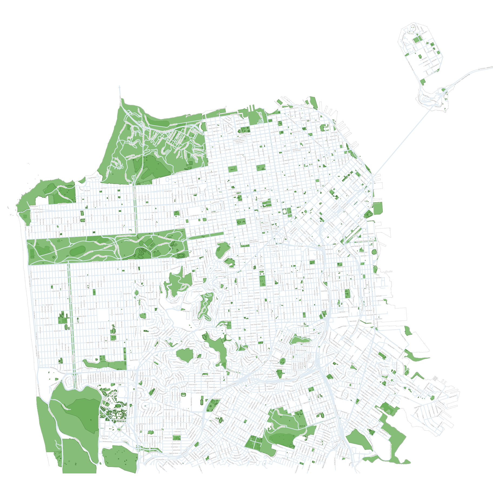

# SF area map

openstreetmap data visualized with QGIS



```bash
# download metadata about county oF SF
# https://www.openstreetmap.org/relation/111968#map=15/37.7067/-122.4405&layers=HD
wget -O sf-county.osm https://www.openstreetmap.org/api/0.6/relation/111968/full

# download map data for all of northern california
# https://download.geofabrik.de/north-america/us/california/norcal.html
wget https://download.geofabrik.de/north-america/us/california/norcal-latest.osm.pbf
# extract just SF county
osmium extract -p sf-county.osm norcal-latest.osm.pbf --output sf-county.osm.pbf
# load into postgres with GIS with lua
osm2pgsql -d m -O flex -S streets.lua sf-county.osm.pbf --host localhost --username=m --password --keep-coastlines
# open QGIS project
```